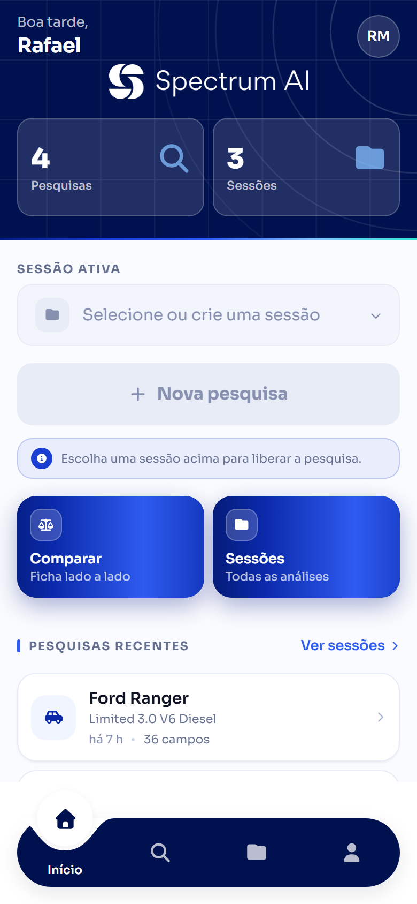
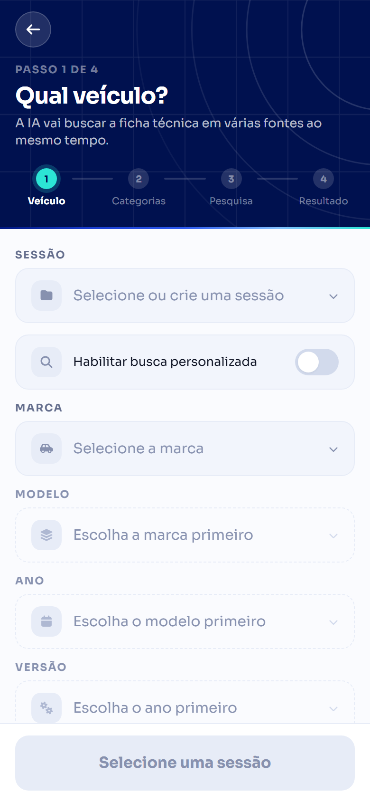
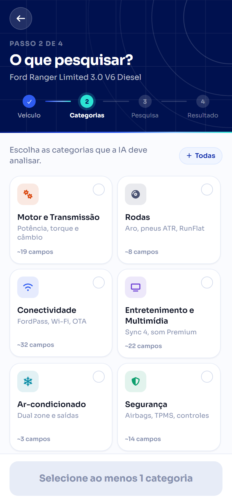
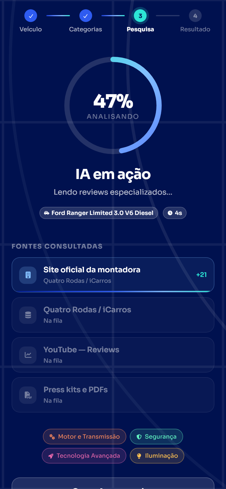
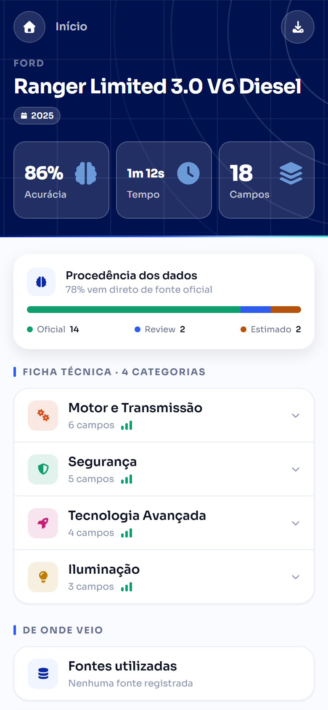
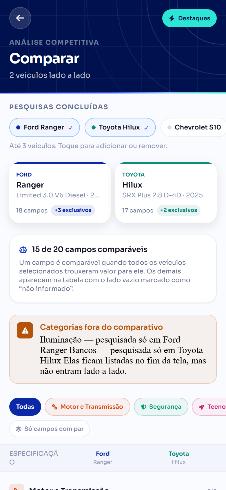
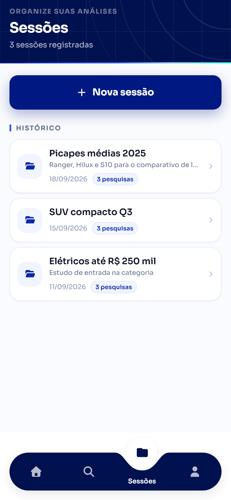
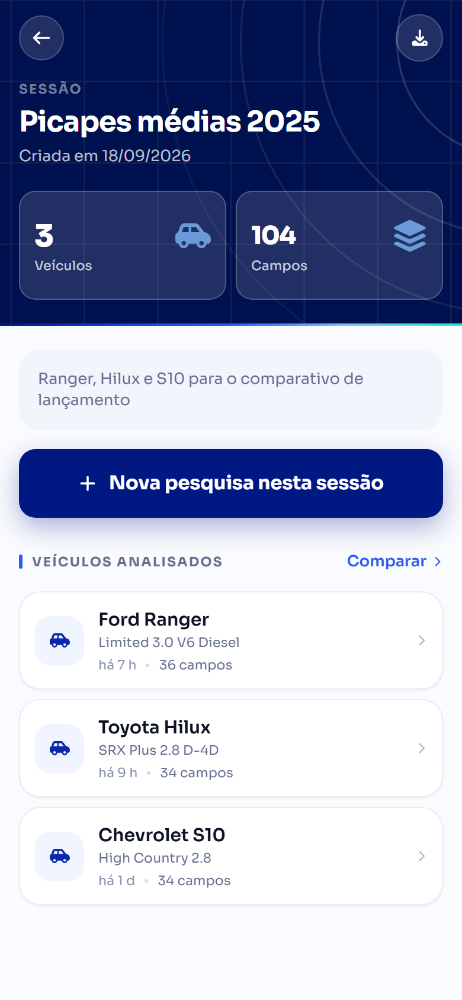

# Spectrum AI Mobile

Aplicativo mobile (React Native + Expo) do projeto **Spectrum AI** — uma plataforma de comparação inteligente de veículos com apoio de IA. O app permite que o usuário pesquise veículos, compare especificações lado a lado, visualize resultados detalhados e gerencie o histórico de pesquisas.

## Integrantes

- **Caio Alexandre dos Santos** - RM: 558460
- **Leandro do Nascimento Souza** - RM: 558893
- **Rafael de Mônaco Maniezo** - RM: 556079
- **Vinicius Rozas Pannuci de Paula Cont** - RM: 555338

## Sobre o projeto

O Spectrum AI Mobile é o cliente mobile que consome a API do Spectrum AI (`https://spectrum-ai-api-rest-production-3a8b.up.railway.app`, sobrescrevível por `EXPO_PUBLIC_API_URL`) e oferece as seguintes funcionalidades principais:

- **Autenticação** com login e registro de usuários, com armazenamento seguro de credenciais (`expo-secure-store`). O cadastro só conclui com o **aceite explícito da LGPD** (ver [Privacidade e LGPD](#privacidade-e-lgpd)).
- **Home** com saudação, métricas do usuário e as pesquisas recentes.
- **Sessões de análise**: toda pesquisa pertence a uma sessão (nome livre, vinculada ao tenant e ao usuário criador). É possível criar sessões pela Home, pela aba Sessões ou no meio do fluxo de pesquisa.
- **Pesquisa de veículos** em quatro passos (veículo → categorias → processamento → resultado), sempre vinculada a uma sessão. O seletor de marca/modelo/ano/versão vem do catálogo da API; quando o carro não está lá (importado, lançamento recente), a **busca personalizada** libera os campos para digitação livre.
- **Acompanhamento em tempo real** do processamento da IA por Server-Sent Events: a tela de processamento mostra o percentual, o tempo decorrido e cada fonte sendo consultada.
- **Tela de resultados** com a ficha técnica por categoria, a distribuição de procedência dos dados e o detalhe campo a campo.
- **Comparação de veículos** lado a lado, sobre dados reais. Como a API não expõe
  endpoint de comparativo, a tela cruza no cliente N respostas de
  `GET /v1/searches/{id}/result`. As regras de negócio ficam isoladas em
  `src/utils/compare.ts`: compara-se a **interseção** das categorias pesquisadas
  (as chaves de `specs`), o que só um veículo tem é listado à parte em vez de
  sumir, e o destaque de "melhor valor" é deliberadamente estreito — só campos
  numéricos de direção conhecida e Sim/Não, nunca sobre dado marcado como
  estimado.
- **Histórico de sessões** persistido na API, com nome, data de criação e as pesquisas de cada sessão.
- **Perfil** com identificação do usuário, papel no tenant e saída da conta.
- **Exportação de dados** em dois escopos: a ficha técnica de uma pesquisa (tela de resultados) ou o comparativo com todos os veículos da sessão em um único CSV (tela de detalhe da sessão). O PDF já aparece no menu, mas ainda não é gerado pelo backend — a API responde `501`.

## Telas da aplicação

> Capturas da build web em viewport de 390×844 (proporção de celular), com dados
> de exemplo. As telas são as mesmas do app nativo — o código de interface é
> compartilhado.

| Login | Cadastro | Home |
| :---: | :---: | :---: |
|  |  |  |
| Banner da marca com a malha de varredura; o formulário ocupa a metade de baixo, no alcance do polegar. | Mesma moldura, com medidor de força da senha e o aceite da LGPD — sem marcar, o cadastro não avança. | Saudação, métricas reais da API, sessão ativa e histórico recente. |

| Pesquisa (passo 1) | Categorias (passo 2) | Processamento (passo 3) |
| :---: | :---: | :---: |
|  |  |  |
| Marca → modelo → ano → versão, encadeados. O interruptor libera a busca personalizada. | 14 categorias, cada uma com cor e ícone próprios. Selecionada, o bloco assume a cor. | Anel de progresso, cronômetro e as fontes sendo consultadas, ao vivo por SSE. |

| Resultado (passo 4) | Detalhe do campo | Comparação |
| :---: | :---: | :---: |
|  |  |  |
| Acurácia, tempo, distribuição de procedência e a ficha técnica em acordeão. | Valor por inteiro e o que aquela procedência significa na prática. | Interseção das categorias, destaque do melhor valor e o que só um dos veículos tem. |

| Sessões | Detalhe da sessão | Perfil |
| :---: | :---: | :---: |
|  |  |  |
| Histórico de análises, com a contagem de pesquisas de cada uma. | Veículos da sessão, atalho para nova pesquisa e exportação do comparativo. | Identificação, papel no tenant, atalhos e saída da conta. |

## Stack tecnológica

- **React Native 0.81** + **Expo 54** (nova arquitetura habilitada)
- **TypeScript**
- **React Navigation** (native stack)
- **TanStack Query** para gerenciamento de estado assíncrono e cache de requisições
- **Axios** para chamadas HTTP
- **react-native-sse** para Server-Sent Events
- **Expo Secure Store** + **AsyncStorage** para persistência local
- **FontAwesome** (`@fortawesome/react-native-fontawesome`) para a iconografia
- **Google Fonts (Sora)** via `@expo-google-fonts/sora` (pesos 300–800), carregada pelo plugin `expo-font`
- **react-native-svg** para os elementos gráficos da marca (degradês, anéis, malha, entalhe da navegação)
- **expo-dev-client** + **EAS Build** — o app roda em development build, não no Expo Go (ver [Como executar](#como-executar))

## Identidade do app

| | |
| --- | --- |
| Nome | Spectrum AI |
| Slug | `spectrum-ai` |
| Pacote Android | `com.aevumsystems.spectrumai` |
| Projeto EAS | `5d0b5117-4681-4497-9ec1-dc7bd1cfe26d` (owner `spectrum-ai`) |

O Android roda em **edge-to-edge** (`edgeToEdgeEnabled: true`). Isso tem uma
consequência prática que aparece no código: a janela não encolhe mais quando o
teclado sobe, então o tratamento de teclado não pode depender do
`adjustResize` — ver `src/components/ui/Keyboard.tsx`.

## Estrutura do projeto

```
src/
├── components/
│   ├── ui/        # DESIGN SYSTEM — primitivos usados por todas as telas:
│   │              #   Txt, Icon, Button, Card, Badge, Field, Checkbox, Sheet,
│   │              #   Stepper, Callout, ConfirmSheet, Keyboard, Screen/ScreenHeader,
│   │              #   Feedback (skeleton/vazio/erro) e Spectrum
│   │              #   (SpectrumRay, SpectrumFlow, ScanGrid, BrandMark, Progress*)
│   └── *.tsx      # componentes de domínio (SearchCard, SessionCard, SpecTable,
│                  #   BottomNav, ConfidenceSummary, ExportSheet…)
├── config/        # Configuração de ambiente (URL da API etc.)
├── constants/     # searchCatalog.ts — catálogos fixos sem endpoint no backend:
│                  #   as 14 categorias de pesquisa (o `backendKey` precisa bater
│                  #   1:1 com SearchRequest.categories) e as fontes exibidas
│                  #   durante o processamento
│                  # legal.ts — endereços da Política de Privacidade e dos Termos
│                  #   de Uso exibidos no aceite da LGPD
├── contexts/      # Context providers (AuthProvider, SessionProvider)
├── hooks/         # useSearches, useSearchCards, useSessions, useVehicles
├── navigation/    # Configuração de navegação (RootNavigation)
├── screens/       # Telas da aplicação
│   ├── auth/      # AuthLayout, LoginScreen, RegisterScreen
│   ├── home/      # HomeScreen
│   ├── search/    # SearchScreen, CategoriesScreen, ProcessingScreen
│   ├── sessions/  # SessionsScreen, SessionDetailScreen
│   ├── result/    # ResultScreen, FieldDetailScreen
│   ├── compare/   # CompareScreen
│   └── profile/   # ProfileScreen
├── services/      # Camada de comunicação com a API (auth, searches, sse, etc.)
├── styles/        # theme.ts — todos os tokens de design
├── types/         # api.ts (contratos da API) e ui.ts (contratos de view)
└── utils/         # compare.ts (regras da comparação), date.ts
```

## Design system

A interface inteira sai de `src/styles/theme.ts` e de `src/components/ui`. Nenhuma
tela declara cor, fonte ou espaçamento solto — se um valor não existe no tema, ele
entra no tema primeiro.

**A ideia da marca.** *Spectrum* é o produto que varre um espectro de fontes e faz
tudo convergir num dado só. Quatro elementos carregam essa ideia na interface:

| Elemento | O que é | Onde aparece |
| --- | --- | --- |
| **Spectrum Ray** | Faixa em degradê `#001881 → #2E5BF0 → #83C0FF → #2CE5D5` | Costura entre header e corpo, barras de progresso, feixe da fonte em consulta |
| **Spectrum Flow** | Degradê azul que se desloca devagar (`<SpectrumFlow>`) | Fundo dos atalhos da Home |
| **Scan Grid** | Malha e arcos concêntricos discretos | Fundo de todo header escuro |
| **Procedência como luz** | Oficial / Review / Estimado lidos por intensidade | Ficha técnica, resumo do resultado, detalhe do campo |

**Cores.** `#001881` é o ponto fixo da identidade e a rampa `brand.50…950` foi
construída a partir dele. `#83C0FF` (sky) é o segundo tom oficial; `#2CE5D5` (aqua)
é o acento de assinatura, usado com parcimônia. Os neutros são levemente azulados
para casarem com o azul da marca.

**Tipografia.** Sora, pesos 300 a 800. O peso vem sempre da família (`fontFamily`),
nunca de `fontWeight` — peso sintético sobre fonte custom desanda no Android. Use
sempre `<Txt variant="…">`; `<Text>` direto fica sem a fonte da marca.

**Cor por categoria.** Cada categoria de pesquisa tem matiz próprio
(`theme.hues`), resolvido junto com o ícone por `categoryIdentity(nome)` — a
mesma função serve a tela de categorias, a de resultado e a de comparação, então
"Segurança" é sempre o mesmo verde com o mesmo escudo em qualquer lugar. O azul
segue dono da moldura (headers, botões, navegação); os matizes vivem só dentro do
conteúdo, onde 14 blocos idênticos em azul transformavam a escolha em leitura de
texto em vez de reconhecimento visual. Selecionado, o bloco assume a cor da
categoria no ícone, na moldura e no halo.

Sobre fundo escuro (a tela de processamento) a mesma cor passa por
`liftForDark()`, que sobe só o L em HSL. Misturar com branco resolveria o
contraste mas lavaria o matiz — o laranja de "Motor" viraria salmão e deixaria de
ser reconhecível como a mesma categoria.

**Procedência do dado.** `OFFICIAL` é verde, `REVIEW` é o azul da marca e
`ESTIMATED` é âmbar — deliberadamente não é vermelho: um dado inferido não é um
erro, e vermelho aqui treinaria o usuário a ignorar os alertas de verdade.

**Estados.** Carregamento usa *skeleton* (`SkeletonList`), não spinner; vazio e erro
usam `EmptyState` / `ErrorState`, com ação de saída sempre que houver uma.

**Destaques.** Dicas, avisos e explicações passam por `<Callout>`: selo de ícone
sólido e fundo tingido com moldura no mesmo matiz. Nunca vermelho — dica não é
erro. Use `compact` para hints de uma linha ao lado de um campo.

**Confirmações.** Use `<ConfirmSheet>`, nunca `Alert.alert`. No React Native Web
o `Alert` é literalmente um no-op (`static alert() {}`), então toda confirmação
montada sobre ele — sair da conta, cancelar a pesquisa — simplesmente não
acontecia na versão web.

**Teclado.** Use `<KeyboardAvoider>`, nunca o `KeyboardAvoidingView` direto. A
receita comum (`behavior` só no iOS) deixa o Android sem comportamento nenhum, e
em edge-to-edge a janela não encolhe mais sozinha — o teclado cobria os campos.

**Hierarquia dos botões.** `primary` (azul-marinho `#001881`) é sempre o próximo
passo do fluxo, e só existe um por tela. `accent` (azure `#2E5BF0`) é para ações
fortes que não continuam o fluxo — comparar, por exemplo. Depois vêm `secondary`,
`ghost` e `danger`.

**Navegação inferior.** Pílula escura com a "bolha líquida": o item ativo vira um
círculo que salta para fora da barra, e a superfície afunda em curva côncava ao
redor dele. O entalhe é um caminho SVG pintado na cor do fundo e deslocado por
`translateX`, o que mantém a animação na thread nativa (`src/components/BottomNav.tsx`).

## Privacidade e LGPD

O cadastro exige **aceite explícito** do tratamento de dados pessoais antes de
criar a conta, seguindo o art. 8º da Lei nº 13.709/2018 (LGPD), que pede
manifestação **livre, informada e inequívoca** do titular.

**O que o usuário vê.** Na tela de cadastro (`src/screens/auth/RegisterScreen.tsx`),
logo abaixo dos campos, uma caixa de seleção com o texto:

> Li e concordo com a Política de Privacidade e os Termos de Uso, e autorizo o
> tratamento dos meus dados pessoais conforme a Lei nº 13.709/2018 (LGPD).

**As regras aplicadas.**

- A caixa nasce **desmarcada**, sempre. O primitivo `<Checkbox>` nem expõe prop de
  valor inicial, justamente para fechar essa porta: caixa pré-marcada não é
  aceite, é presunção — e o art. 8º §4º anula autorização genérica.
- Sem o aceite, **Criar conta** não envia nada. A validação interrompe o envio e
  mostra "É preciso aceitar para criar a conta." abaixo da caixa; marcar limpa o
  erro na hora.
- A linha inteira (caixa + texto) é área de toque. Alvo pequeno numa tela de
  consentimento é exatamente o atrito que faz o usuário clicar sem ler.
- O estado vai para os leitores de tela (`accessibilityRole="checkbox"` +
  `aria-checked`), então quem usa TalkBack/VoiceOver ouve se está marcado ou não.

**Os documentos.** Os endereços da Política de Privacidade e dos Termos de Uso
ficam em `src/constants/legal.ts`. Enquanto as constantes estiverem vazias, os
nomes aparecem como **texto comum**; assim que receberem uma URL viram links
tocáveis sozinhos, sem mexer em nenhuma tela. É proposital — link morto numa tela
de consentimento é pior do que link nenhum.

**Limitação conhecida: o aceite não é persistido.** Hoje o consentimento existe só
no cliente. O contrato de `POST /auth/register` é
`{ companyName, fullName, email, password }` e não tem campo para o aceite, então
ele não chega ao servidor nem fica registrado em lugar nenhum.

Na prática, o app cumpre o **dever de informar**, mas não produz **prova** do
consentimento — e o art. 8º §2º coloca no controlador o ônus de comprovar que o
titular consentiu. Fechar essa lacuna depende do backend: gravar, no momento do
cadastro, quem aceitou, quando (timestamp) e **qual versão** dos documentos estava
no ar. Sem a versão o registro perde a serventia, porque não dá para dizer com o
que a pessoa concordou.

## Pré-requisitos

- **Node.js** 18 ou superior
- **npm** (ou yarn/pnpm)
- Para rodar no dispositivo, **uma** das opções:
  - um **development build** instalado no aparelho (gerado por EAS Build ou localmente), **ou**
  - Android Studio / Xcode configurados, para compilar localmente com `npm run android` / `npm run ios`

> O projeto usa `expo-dev-client`, então **não roda no Expo Go**. As pastas
> `android/` e `ios/` não são versionadas — o Expo as gera no `prebuild`.

## Instalação

```bash
git clone https://github.com/<owner>/spectrum-ia-mobile.git
cd spectrum-ia-mobile
npm install
```

## Configuração de ambiente

A URL da API é controlada pela variável de ambiente `EXPO_PUBLIC_API_URL`. Caso não seja definida, o app aponta por padrão para `https://spectrum-ai-api-rest-production-3a8b.up.railway.app`.

Para apontar para uma API local em desenvolvimento, crie um arquivo `.env` na raiz do projeto:

```env
EXPO_PUBLIC_API_URL=http://192.168.0.10:8000
```

> Em produção a URL **deve** usar HTTPS. Em desenvolvimento, são aceitas URLs `http://` apenas para `localhost`, `127.0.0.1`, `10.0.2.2` (emulador Android) e redes LAN privadas.

## Como executar

```bash
# Sobe o Metro. Abra pelo development build instalado no aparelho.
npm start

# Compila e instala o app nativo (precisa de Android Studio / Xcode)
npm run android
npm run ios

# Versão web, útil para inspecionar layout rápido
npm run web
```

Depois de mudar dependências, suba o Metro com o cache limpo: `npx expo start -c`.

### Gerando um build pelo EAS

Os perfis ficam em `eas.json`. O mais usado no dia a dia é o `preview3`, que gera
um development build instalável:

```bash
npx eas build --profile preview3 --platform android
```

| Perfil | O que gera |
| --- | --- |
| `preview` | APK de release |
| `preview2` | Release via `:app:assembleRelease` |
| `preview3` | Development build (`developmentClient: true`) |
| `preview4` | Distribuição interna |
| `production` | Build de produção |

## Scripts disponíveis

| Script             | Comando            | Descrição                                               |
| ------------------ | ------------------ | ------------------------------------------------------- |
| `npm start`        | `expo start`       | Sobe o Metro para o development build                    |
| `npm run android`  | `expo run:android` | Compila e instala o app nativo no Android                |
| `npm run ios`      | `expo run:ios`     | Compila e instala o app nativo no iOS                    |
| `npm run web`      | `expo start --web` | Executa a versão web do app                              |
